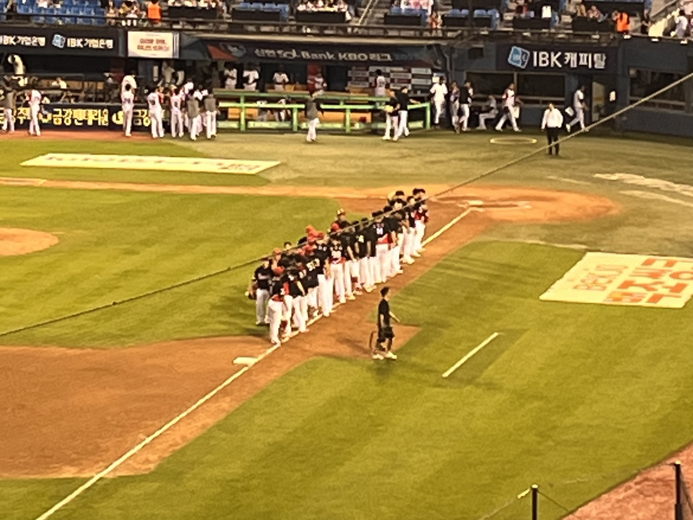

6월에는 본격적으로 채용 시장에 뛰어들어 과제와 면접을 치르며, 막연했던 불안감이 부족함이라는 구체적인 형태로 다가왔다.

## 사전 과제와 면접들

6월 중에는 수많은 지원과 탈락의 반복이 이어졌고, 그 와중에 몇 번의 사전 과제와 면접을 치르게 되었다. 오랜만에 면접을 보다 보니 이런 감각을 많이 잊고 있었다는 생각이 들었고, 나의 부족함을 더 들여다볼 수 있었다.

이번 한 달을 돌아보며, 스스로에게 남기고 싶은 **월말 평가**를 간단히 정리해보자.

### 명확한 근거가 필요하다

코드를 작성할 때 나름의 근거를 가지고 있다고 생각했지만, 막상 질문에 답하려다 보니 충분히 고민하지 않았다는 생각이 들었다. 앞으로는 반복적인 질문을 통해 익숙해져야 할 것이다.

- 어떤 목적으로 이런 코드를 작성했는가
- 목적을 달성하기 위한 최선의 구현 방식인가
- 다른 대안이 있었다면 선택한 이유는 무엇인가

### 내실을 다져야한다

모든 코드가 어떻게 동작하는지 이해한 뒤 작성해야 한다고 생각해왔지만, 그 원칙을 충실히 지키지 못하고 있었던 것 같다. 잘 알고 있다고 생각한 개념일수록, 정말 명확하게 이해하고 있는지 점검해보는 시간이 필요하다는 생각이 들었다.

## 앞으로의 방향

작은 프로젝트를 개발해보기도 하고 자격증 취득을 위한 공부도 해봤지만, 취업에 대한 강박으로 인해 방향성 없이 마구잡이로 시작한 것들이 많았다. 불안함은 잠시 접어두고, 필요한 작업을 차근차근 해나가다 보면 언젠가는 목표에 도달할 수 있을 거라는 마음으로 임할 예정이다.

### 사이드 프로젝트의 이유

사이드 프로젝트는 보통 ‘이런 걸 한번 만들어보고 싶다’는 가벼운 마음으로 시작하는 경우가 많지만, 수익화나 실제 유저 확보 같은 명확한 기준이 생기면 오히려 시작이 쉽지 않다. 실제로 프로젝트를 진행하다 보면 <strong>'다른 서비스가 아닌 이 서비스를 쓸 이유가 있나?’</strong>라는 근본적인 의문에 부딪히고, 그에 대한 답을 찾지 못해 중단하게 되는 경우가 많았다.

이런 문제가 반복된 원인을 곱씹어보면, 실제 사용자의 불편을 해소하려는 것보다 세상에 없던 무언가를 만들고자 했던 욕심이 컸다는 생각이 든다. 앞으로는 기존에 존재하던 서비스에 새로운 아이디어를 결합하는 형태로 사이드 프로젝트를 진행하게 될 것 같다.

> 클론 프로젝트와는 조금 다를 것이다. 그래야만 한다.

기존에 괜찮다고 느꼈던 서비스를 기반으로 기능을 개발하는 과정에서, 그 의도를 이해하고 더 나은 방향을 고민할 수 있을 거라는 기대가 있다.

### 테스트, 해야겠지?

그동안 실무에서도 테스트 코드에 익숙하지 않거나 시간적 여유가 없다는 이유로 작성하지 않고 넘어가는 경우가 많았다. 그래서 나는 아직 테스트 코드를 제대로 작성하지 못하는 사람이며, 이러한 부분은 채용 과정에서 경쟁력이 떨어질 수 있는 요소라고 생각한다.

> 채용 공고나 사전 과제에서도 가산점에 해당한다. 작성할 수 있다면 좋은 것이다.

왜 테스트 코드를 작성하면 좋을까? 팀 마다 사정이 다르겠지만 몇 줄의 테스트 코드로 실제로 발생할 수 있는 크리티컬한 오류를 방지하고, 그로 인한 비용 손실을 막을 수 있다면 충분히 도입할 만한 가치가 있을 것이다.

유저가 많은 대규모 서비스일수록 안정성에 대한 요구는 클 수밖에 없고, 테스트 코드를 유지보수하는 데 드는 비용을 감수하더라도 도입할 충분한 이유가 된다. 그렇게 본다면, 테스트하기 좋은 코드와 좋은 테스트 코드에 대한 이해가 있다면 테스트 작성 및 유지에 드는 비용도 자연스럽게 줄일 수 있을 것이다.

그럼 테스트 코드를 잘 작성해야 하는 이유를 요약하면 아래와 같다.

- 테스트 코드로 실제 금전적・시간적 손해를 줄일 수 있다면, 유지보수 비용을 감안하더라도 충분히 도입할 만한 가치가 있을 것이다.
- 좋은 테스트 코드 혹은 테스트 하기 좋은 코드는 유지보수 비용을 낮추는데 도움을 줄 것이다.

이런 이유로 앞으로 진행할 프로젝트에는 점진적으로 테스트 코드를 도입해나갈 예정이다.

## 개발 외의 것들

요즘 고민의 중심이 취업에 있다보니 개발 얘기가 좀 길었다. 계속 그렇게 생각하면 피폐해지기에 나를 환기시키는 다른 것들에 대해 적어보고자 한다.

### 타이거즈 전반기엔 감동이 있었다

> 정확히 말하자면 전반기 일정은 7월 10일에 마무리되었지만, 이 글을 작성하는 기준일이 7월 11일이라 제목을 이렇게 지었다.

지난해에는 정규 시즌과 한국시리즈 우승을 모두 차지했으며, 그 배경에는 탄탄한 뎁스가 있었기에 가능했다는 평가가 있었다. 다만 작년에도 주전들이 꾸준히 출전해준 덕분에, 뎁스의 진가를 온전히 실감하기는 어려웠다는 생각도 있다.

하지만 올해 전반기는 기대 이상의 뎁스 활약이 돋보였던 시기였고, 그만큼 타이거즈의 야구를 지켜본 팬들은 분명 즐거웠으리라고 생각한다.

> 적어도 나는 작년보다 올해가 더 재밌다고 생각한다.

시즌 초부터 시작된 줄부상으로 인해 1군 라인업 대부분이 2군 선수들로 구성되어 있었고 5위 안에 들어갈 것이라는 기대도 하지 않고 있었다. 이 와중에 최형우 선수가 인터뷰 중 후배들에게 해줄 말이 있지 않겠느냐는 이순철 위원의 말에 대한 대답이 도움이 된 것처럼 거짓말같이 순위가 올라가기 시작했다.

> "자기 자신 위치에 맞는 플레이를 하면 되지 않을까, 더군다나 지금은 이제 솔직히 여기 있는 모든 후배들이 기회잖아요 어떻게 보면. 물론 팀은 안 좋지만, 저는 이게 자기 거라고 생각하고 했으면 좋겠어요. 뭐 누가 나 낫고 올라오면 또 밀려나겠지 이런거 말고, 자기가 여기서 잘해서 누가 와도 밀어내면 돼요. 저도 어렸을때 부터 그렇게 컸고, 그냥 자신감 있게 했으면 하는 바램."

실제로 최형우 선수는 방출과 경찰 야구단, 신고 선수 시절을 거쳐 FA까지 쉽지 않은 길을 걸어온 끝에 꽃을 피운 선수다. 주전 복귀로 자리를 내줘야 할지도 모른다는 불안 속에서도, 이런 한 마디는 선수들이 더 당당하고 패기 있게 경기에 임할 수 있도록 북돋아주는 응원이 되었을 것 같다.

그래서 올해 전반기는 김규성, 김호령, 오선우, 성영탁, 고종욱, 홍원빈, 이호민 등 숨은 자원들의 가치를 재조명할 수 있었던 시기였고, 후반기까지 좋은 흐름을 이어가며 연속 우승에 도전할 수 있기를 기대해본다.

### 행운을 빌어줘

<iframe
  className="w-full"
  width="560"
  height="315"
  src="https://www.youtube.com/embed/hrXCP0xeoA8?si=9QuD0sS644inp0G2"
  title="YouTube video player"
  allow="accelerometer; autoplay; clipboard-write; encrypted-media; gyroscope; picture-in-picture; web-share"
  referrerPolicy="strict-origin-when-cross-origin"
  allowFullScreen
/>

[야구 관련 쇼츠](https://www.youtube.com/shorts/d88pZnuwMow)를 보다가 알게된 노래인데, 데뷔 첫 안타 기념공을 챙겨주는 모습과 영상에 깔린 음악이 잘 어울린다고 생각이 들었고 이후에도 간간히 유튜브 뮤직으로 듣게 되는 노래다. 이런 벅차오르는 느낌의 노래를 좋아하는데 디지몬 어드벤처 OST인 Butter-Fly나 쾌걸 근육맨 OST인 질풍가도 같은 노래를 좋아한다면 이 노래도 아마 입맛에 맞으리라 생각한다.

> 지극히 제 취향에 근거한 의견입니다.

요즘 여러모로 행운이 필요한 시기라 그런 말이 더 크게 와닿았던 것 같기도 하다. 아무쪼록 많은 행운이 찾아오길 바라며, 그 행운을 놓치지 않고 잡아낼 수 있는 사람이 되어야겠다.
