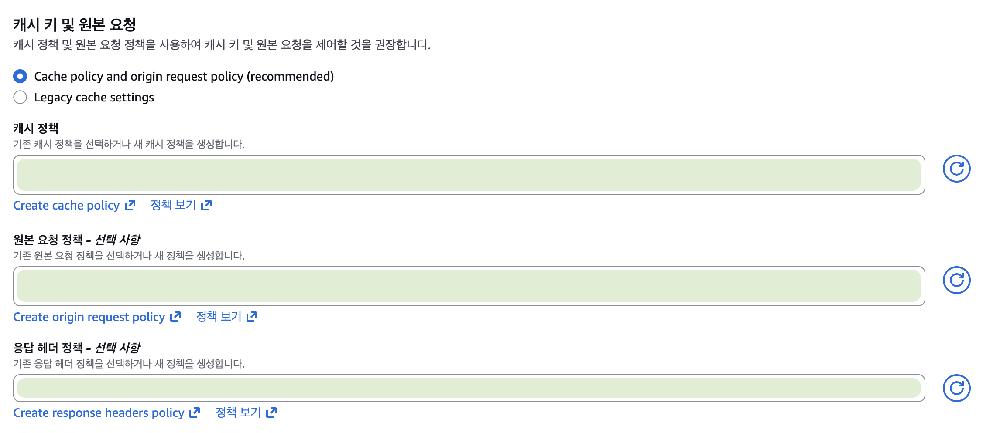

서비스 개발을 하다보면 AWS의 S3를 사용할 기회가 한 번씩은 생길 것이다. 프론트엔드 파트에서 보통 직접 S3에 접근하는 경우는 드물고 대부분 CloudFront 혹은 백엔드를 경유해서 접근하곤 하는데,
그렇다고 CloudFront에 대해 깊이 이해할 기회가 그리 많지는 않을 것이라 생각한다.

> 그렇다고 중요하지 않은건 아니다.

이번 포스팅의 내용은 우연히 마주한 CORS 오류로부터 시작되어 CloudFront 캐싱 메커니즘 파악까지 이어진 약 3시간 동안 진행된 디버깅 기록이다.

## 우연히 마주한 CORS 오류

사건의 발단은 카카오톡 인앱 브라우저에서 발생하는 문제를 해결하기 위해 Flask 기반 프론트엔드 프로젝트를 수정하던 중이었다.

최근 내가 진행했던 내용 중 기존에 클라이언트에서 CloudFront URL을 fetch해 파일을 다운로드하고 있었으나,
카카오톡 인앱 웹뷰 호환을 위해 서버에서 파일을 중계하는 방식으로 변경한 이력이 있었다.

이후 해당 변경사항을 수정해야 했던 일이 있었는데 이를 롤백한 뒤 다운로드 시도를 하니 **갑자기 CORS 오류가 발생했다.**


당황스러웠던 점은, **AWS 콘솔에 접속해 어떤 설정도 변경하지 않았음에도 불구**하고 CORS 오류가 발생했다는 점이었다.

이전 히스토리에 대해 부족한 상황이었으니 AWS 설정 관련된 히스토리는 다른 개발자분꼐 전달받기로 하고 소스 코드 단에서의 수정사항을 확인해보고자 했다.

## 무엇이 달라졌을까

우선 지금까지의 작업 히스토리를 도식화 해보면 다음과 같이 표현할 수 있다.

1. **클라이언트에서 CloudFront URL로 `fetch` 요청을 보내 파일 다운로드**
   - `fetch` → 응답을 `Blob`으로 변환 → `<a>` 태그를 통해 다운로드
   - 다운로드 정상 동작 확인
2. **서버 측 프록시 다운로드 방식 적용**
   - Flask에 GET 메서드 라우트 추가
   - 서버에서 CloudFront 파일을 요청·수신한 뒤 스트리밍 응답으로 전달
   - 카카오톡 인앱 웹뷰의 내부 다운로드 기능 정상 동작 확인
3. **다운로드 로직을 기존 클라이언트 `fetch` 방식으로 롤백**
   - 서버 프록시 다운로드 코드 제거
   - 클라이언트에서 다시 CloudFront URL로 `fetch` 요청 수행
4. **롤백 이후 다운로드 테스트 진행**
   - 다운로드 버튼 클릭 시
   - 브라우저에서 CORS 오류 발생

큰 틀에서 보면 변경사항의 흐름은 클라이언트 요청 처리에서 서버 요청 처리로, 그리고 다시 클라이언트 요청 처리로 돌아오고 있다. 이를 간략하게 CORS 오류와 연관지어 차이점을 표로 정리해보면 다음과 같다.

| 기준                    | 클라이언트 요청 | 서버 요청         |
| ----------------------- | --------------- | ----------------- |
| 실행 위치               | 브라우저        | 서버 프로세스     |
| 코드 위치               | JS (`fetch`)    | Flask route 내부  |
| 네트워크 요청 발생 주체 | 사용자 브라우저 | 서버 애플리케이션 |
| CORS 적용               | ✅              | ❌                |

<Callout type="info" >
**CORS는 왜 브라우저에만 해당되는걸까?**

CORS는 웹 브라우저가 Same-Origin Policy(동일 출처 정책)을 기반으로 스크립트의 cross-origin 요청을 제한할 때, 서버가 허용 여부를 알려주는 메커니즘이다.
그렇기 때문에 서버 프로세스 자체에는 CORS 검사가 필요하거나 강제되지 않는다.

</Callout>

그렇다면 다음과 같이 가정을 정리해보자.

> 클라이언트 요청에서 서버 요청 처리로 변경되며 문제를 발생시켰는데 서버 요청이었기에 CORS 오류가 발생하지 않았고, 롤백 한 뒤 클라이언트 요청 처리로 돌아와 CORS 오류가 발생했다.

이제 <strong>'서버 요청으로의 변경사항'</strong>이 어떻게 문제를 발생시켰는지 알아볼 차례다.

## 클라우드 환경에서 발생한 문제

우선 서버 요청이 발생시킨 문제를 찾기 전에, AWS에서 문제를 발생시킨 것은 아닌지 확인하기 위해 **S3 혹은 CloudFront와 관련되어 CORS를 발생시킬 수 있는 경우의 수**를 파악해보고자 한다.

### S3 버킷 설정 확인하기

S3 버킷에서 CORS 관련 설정은 AWS 콘솔에서 버킷 설정 → 권한 탭을 통해 확인할 수 있다. 최하단을 보면 CORS와 관련된 내용이 JSON 형식으로 정의되어 있다.

```json
[
  {
    "AllowedHeaders": ["*"],
    "AllowedMethods": ["HEAD", "GET", "PUT", "POST", "DELETE"],
    "AllowedOrigins": ["*"],
    "ExposeHeaders": []
  }
]
```

현재 우리 프로젝트에 해당하는 S3 버킷 설정은 CORS 오류를 발생시킬 요소가 존재하지 않았고, 사실 이 부분은 히스토리 공유로 이미 파악이 되었기에 S3 버킷은 대상에서 제외했다.

### CloudFront 설정 확인하기

CloudFront 설정에서 CORS 관련 설정은 AWS 콘솔에서 CloudFront → 배포 → 배포 상세 → 해당하는 프로젝트의 동작 편집 탭을 통해 확인할 수 있다.



이 중 **응답 헤더 정책** 항목에서 정책이 설정되어 있는지 확인해보자. 우리의 경우 정책이 설정되어 있지 않았고 임의 허용을 위해 사전에 정의된 SimpleCORS 정책을 적용했다.

<Callout type="info">
  **CloudFront 응답 헤더 설정과 CORS 오류와의 상관관계**

CloudFront에서 CORS 관련 응답 헤더가 올바르게 포함되지 않으면, 브라우저는 해당 응답을 CORS 정책 위반으로 판단하고 차단한다.

이는 일반적인 백엔드 서버에서의 CORS 동작 원리와 동일하며, 최종적으로 브라우저는 **응답 헤더를 기준으로 허용 여부를 판단**한다.

자세한 내용은 [AWS Docs : Understanding response headers policies](https://docs.aws.amazon.com/AmazonCloudFront/latest/DeveloperGuide/understanding-response-headers-policies.html)

</Callout>

응답 헤더 설정도 추가했으니 클라이언트 요청에서 CORS 오류가 발생하지 않을 것이라 생각하고 테스트를 진행했으나, 여전히 CORS 오류가 발생하고 있었다.

이에 대한 원인으로 CloudFront의 요청 캐싱을 고려해보았고, 해당하는 캐시 데이터를 삭제하고 다시 테스트를 진행하니 정상적으로 다운로드가 진행되었다.

더 확실하게 하기 위해 응답 헤더 설정을 제거하고 캐시를 삭제해 다시 테스트를 진행했다. 이 결과가 성공했다면 정확한 문제 파악이 완료되었다는 증거겠지만 **아쉽게도 CORS 오류를 반환하고 있었다.**

이쉽게도 응답 헤더 설정과는 연관이 없다고 판단하여 이를 제외하고 소스 코드 단을 분석해보고자 했다.

## 소스 코드 단에서 문제 파악하기

그럼 이어서 소스 코드 단에서 문제가 발생하지 않았는지 확인해보자.  
기존 코드를 기준으로 서버 요청 처리 흐름은 다음과 같다.

- AWS SDK에서 Python 환경에서 사용 가능한 **Boto3**를 이용해 CloudFront URL로 원본 파일과 메타데이터를 요청하고 수신한다.
- 수신한 파일 정보를 기반으로, 카카오톡 인앱 웹뷰의 내부 다운로드 기능을 사용할 수 있도록 **응답 헤더를 구성한다.**
- 원본 파일 데이터를 활용해 **스트리밍 응답 형태로 응답 헤더와 함께 클라이언트에 반환한다.**

이 중 유심히 봐야하는 부분은 <strong>"CloudFront URL로 원본 파일과 메타데이터를 요청하고 수신한다"</strong>는 부분이다.
이 부분이 유일하게 S3 혹은 CloudFront와 맞닿아 있고 이 과정에서 CORS 오류를 발생시킬 요인을 만들 수 있었다고 생각된다.

또한 캐싱 측면에서 생각해보면 서버 측 요청으로 캐싱된 요청 결과가 추후 클라이언트 요청 단계에서 다시 사용될 때 CORS 오류를 반환한다고 이해할 수 있다.

> CloudFront URL로 데이터를 요청할 때 주체가 클라이언트냐 서버냐에 따라 달라지는 요소는 무엇이 있을까?

응답 결과에서 찾을 수 있었던 힌트는 <strong>`Access-Control-Allow-Origin` 과 `Access-Control-Allow-Methods` 헤더가 존재하지 않는다는 것</strong>이다.

이후 리서치를 통해 서버 요청은 클라이언트 요청과 다르게 `Origin` 헤더가 존재하지 않는다는 것을 확인할 수 있었다.

그치만 여전히 풀리지 않는 문제가 있었다.

## CloudFront 캐싱 딜레이가 만든 오해

여전히 풀리지 않은 문제는 테스트 결과에 있었다. 서버 요청을 진행하고 응답 헤더를 확인한 뒤 클라이언트 요청을 진행했을 때 응답 헤더가 정상적으로 수신된다는 점이었다.

> 테스트는 파이썬으로 CloudFront URL을 통해 파일과 응답 헤더를 분석하고, 브라우저에서 `fetch` 요청을 통해 응답을 받아보는 형태로 진행했다.

이론상 서버 요청을 보낸 이후 클라이언트 요청을 진행하면 캐시된 요청으로 인해
응답 헤더에 `Access-Control-Allow-Origin` 과 `Access-Control-Allow-Methods` 헤더가 존재하지 않아야 하는데,
정상적으로 수신되었다는 것은 이론상 이해할 수 없는 영역에 있었기 때문이다.

그러다 클라이언트 요청을 한 번 더 보냈을 때 요청이 실패하게 되며 CORS 오류가 발생했는데 순간 유레카를 외쳤다.


> "정답은 캐싱에 있었어."

실패를 하자마자 합리적으로 생각했던 것은 **이전 클라이언트 요청이 캐싱되지 않았을 수 있다**는 점이었다.
그렇게 이전의 클라이언트 요청에 대한 캐싱 여부를 `X-Cache` 헤더를 통해 확인해보니 `Miss from cloudfront` 라고 명시되어 있었고,
이는 아직 캐싱이 되지 않았다는 것을 의미했다.

그렇다면 어떻게 응답 헤더가 설정된 상태로 요청을 수신할 수 있었을까?

## 캐싱 전 CloudFront 요청 흐름 파악하기

위 문제는 캐싱이 되기 전 CloudFront 요청의 흐름을 알게 된다면 이해하기 쉬운 문제다.

CloudFront는 캐싱이 되기 전 S3에 요청을 보내 원본 파일로의 요청을 진행한다.
이때, CloudFront의 요청 헤더 관련된 설정이 없는 경우 S3 요청에 포함된 응답 헤더 값들을 그대로 사용하게 되는데,
이 과정에서 S3에 설정한 정책이 반영되어 응답 헤더에 `Access-Control-Allow-Origin` 과 `Access-Control-Allow-Methods` 헤더가 존재하게 된다.

앞서 말했듯이 우리는 S3 버킷에는 정책을 추가해둔 상태였고, 당연하게도 요청에 대한 응답에 정책에 명시된 헤더가 포함되었던 것이었다.

파이썬으로 보낸 요청은 요청 헤더에 `Origin` 헤더가 존재하지 않았기 때문에, S3의 CORS 정책 관련 응답 헤더를 포함하지 않았고
해당 요청이 캐싱되어 추후 캐싱된 요청을 클라이언트에서 수신할 때 CORS 오류가 발생했던 것이다.

> 관련한 내용이 궁금하다면 해당 [블로그 글](https://aws.amazon.com/ko/blogs/networking-and-content-delivery/amazon-cloudfront-introduces-response-headers-policies/?utm_source=chatgpt.com)을 참고해주세요.

## 마무리

이번 디버깅 과정의 결과를 요약하자면 다음과 같다.

- 클라이언트 요청과 서버 요청은 요청 헤더에 `Origin` 헤더가 존재하는지 여부에 차이가 있고, 이에 따라 CORS 관련 응답 헤더를 수신하는데에 차이가 있다.
- CloudFront의 캐싱은 약간의 딜레이가 존재하며, 그 사이에 보낸 요청들은 모두 원본(Origin)으로의 요청을 진행하게 된다.
- CloudFront를 통해 보내는 요청은 캐싱되기 전 S3에 요청을 보내 원본 파일로의 요청을 진행하고, 이 과정에서 S3의 응답을 그대로 사용하기에 사전에 설정된 S3의 정책에 영향을 받을 수 있다.

결국 본질적으로 해결하려고 했던 문제하고는 멀어졌지만 이번 디버깅 과정을 통해 발생할 수 있는 엣지 케이스 중 하나를 발견할 수 있었고,
다른 상황에서도 충분히 발생할 수 있다고 생각하기에 나름 보람찬 시간이었다고 생각된다.

오늘은 여기서


> 끗!
