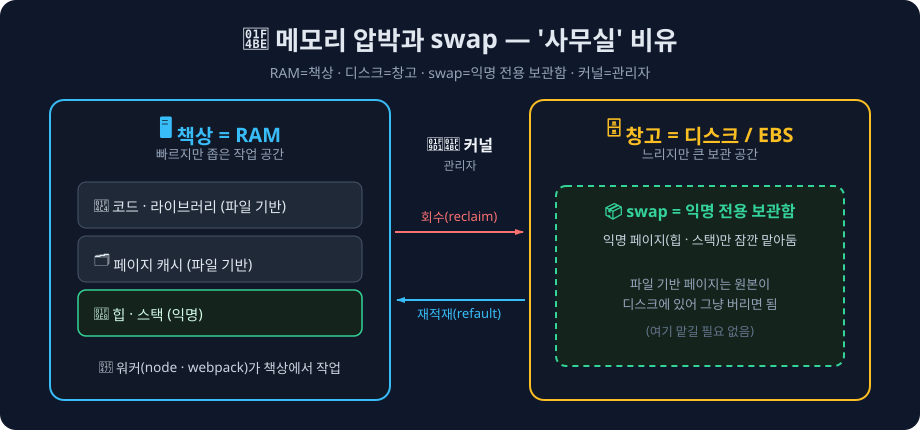
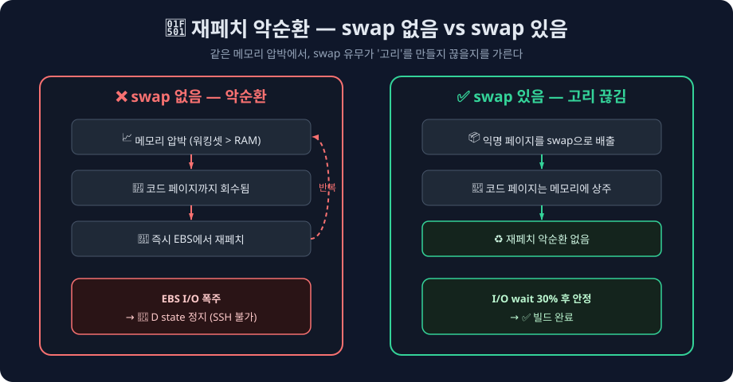

<Callout type="info">
**TL;DR**

EC2에서 Next.js Docker 빌드 중 빌드와 SSH가 함께 멈췄다(AWS 콘솔은 `running` 표시). 원인은 **메모리 압박이 EBS I/O 포화로 이어지며 발생한 스래싱**(thrashing) — SSH를 포함한 사용자 공간 프로세스 대부분이 I/O 완료를 기다리며 묶인 상태였다. **swap 4GB를 추가하자 동일 조건에서 빌드가 완료**되며 완화됐다.

</Callout>

이번 글은 위 결론에 이르기까지 원인을 좁혀간 흐름과, 가설이 실제로 맞는지 직접 재현해 검증한 과정을 정리했다.

## 어느 날 배포가 멈췄다

발단은 평소와 다르지 않은 배포였다. GitHub Actions 로그에는 빌드가 진행 중이었는데, 어느 순간부터 출력이 멈춰 있었다.

```
#13 2.034   Creating an optimized production build ...
            ← 여기서 4분 넘게 멈춤
```

이상한 점은 AWS 콘솔에서 인스턴스가 멀쩡하게 `running`으로 표시된다는 것이었다. SSH로 직접 접속을 시도해봐도 아무런 응답이 없었다. 결국 인스턴스를 재시작하니 정상 동작했고, 며칠 뒤 같은 일이 또 반복됐다.

처음에는 단순히 Next.js 빌드가 느린 줄 알았다. `command_timeout: 30m`을 넉넉히 잡아뒀는데도 멈춘다는 게 이상했고, 무엇보다 **SSH 자체가 응답하지 않는다는 점**이 가장 큰 단서였다.

빌드 프로세스 하나가 느린 게 아니라, 사용자 공간 프로세스 전반이 응답하지 못하는 상태로 보였다.

## 가설 1. CPU 크레딧이 바닥났을까

가장 먼저 떠올린 건 t2 인스턴스의 CPU 크레딧 문제였다. t2 시리즈는 버스트 크레딧 방식이라 크레딧이 소진되면 베이스라인 성능으로 떨어진다. 빌드처럼 CPU를 많이 쓰는 작업이라면 충분히 의심할 만했다.

CloudWatch에서 `CPUCreditBalance` 지표를 확인했다.

```
CPUCreditBalance: 576 (거의 만충)
```

576이면 거의 최대치다. 크레딧 문제는 아니었다. **가설 1 탈락.**

## 가설 2. OOM Kill일까

Next.js 빌드는 메모리를 많이 먹는다. 당시 `NODE_OPTIONS=--max-old-space-size=3072`로 힙 상한을 3GB까지 허용하고 있었는데, 인스턴스 RAM은 3.8GiB(가용 약 2.9GiB)였다. Node.js가 메모리를 다 쓰면 커널이 프로세스를 강제 종료할 가능성이 충분했다.

근데 OOM Kill이 일어나면 반드시 커널 로그에 흔적이 남는다.

```bash
sudo dmesg | grep -i oom
sudo journalctl -k | grep -i "oom\|killed"
```

아무것도 없었다. 게다가 OOM Kill이 일어났다면 프로세스가 죽고 시스템은 다시 응답해야 하는데, 이번 케이스는 SSH까지 막혀 아무것도 되지 않았다. **가설 2도 탈락.**

다만 이 "OOM 흔적이 없다"는 사실은 단순히 메모리가 부족하지 않았다는 뜻이 아니라, 나중에 진짜 원인을 좁히는 중요한 단서가 된다.

## 이상한 점들을 정리해보면

가장 흔한 두 시나리오가 모두 빗나갔으니, 한 발 물러나 지금까지 모은 단서들을 다시 펼쳐놓고 살펴보기로 했다.

| 관찰 | 의미 |
| --- | --- |
| 빌드가 항상 같은 위치(`Creating an optimized production build...`)에서 멈춤 | 특정 단계에서 트리거되는 무언가가 있다 |
| SSH도 응답하지 않음 | 빌드 프로세스만의 문제가 아니다 |
| AWS 콘솔은 인스턴스를 "정상"으로 인식 | 가상화/하드웨어 레벨은 살아 있다 |
| OOM Kill 로그 없음 | 프로세스가 죽은 게 아니다 |
| 재시작하면 복구됨 | 재시작 시 초기화되는 무언가가 원인이다 |
| 간헐적으로 발생 | 특정 조건이 겹쳐야 한다 |

여기서 핵심은 **SSH까지 막혔다**는 점이었다.

<Callout type="info">
**SSH가 응답하지 않는다는 건 무슨 의미일까**

빌드 프로세스 하나만의 문제였다면 SSH는 살아 있어야 한다. SSH 데몬까지 응답하지 못한다는 건 커널 자체가 멈췄다기보다, **거의 모든 사용자 공간 프로세스가 커널의 I/O 응답을 기다리는 D state(uninterruptible sleep)에 빠져 있다**는 신호에 가깝다.

`D state`는 프로세스가 디스크 같은 I/O 완료를 기다리는 동안 들어가는, `kill`로도 깨울 수 없는 상태다.

</Callout>

이런 종류의 시스템 전반 정지를 일으키는 전형적인 원인 하나가 바로 **메모리 압박에서 비롯된 광범위한 I/O wait**다.

자연스럽게 다음 질문이 따라왔다.

> 그렇다면 무엇이 I/O를 막히게 했을까?

## 진짜 원인: 메모리 압박이 부른 스래싱

원인은 EBS였다. 정확히는, **메모리 압박이 EBS I/O 포화로 이어지며 발생한 스래싱(thrashing)** 상태였다.

<Callout type="info">
**스래싱(thrashing)이란**

스래싱은 워킹셋(실제로 필요한 메모리)이 물리 메모리를 넘어설 때, 시스템이 유효한 작업 대신 페이지를 회수하고 다시 읽어들이는 데 대부분의 시간을 쓰는 상태를 말한다. OS 교과서에서 다루는 고전적인 개념이다.

이번 케이스에서는 이 스래싱이 디스크(EBS) I/O 포화로 나타났고, 그 결과 대부분의 프로세스가 D state에 묶여 시스템 전체가 멈춘 것처럼 보였다.

</Callout>

이 가설을 뒷받침할 단서가 있을지 CloudWatch의 EBS 지표부터 뒤져봤다.

`VolumeQueueLength`는 EBS 앞에서 처리를 기다리는 I/O 요청의 평균 큐 길이를 나타내는 지표다. 정상이라면 거의 0에 가까워야 한다.

```
정상 상태:                 ≈ 0
hang 발생 시각(KST 15:19):  1.68
```

평소 0에 가깝던 값이 hang 시점에 1.68로 올라가 있었다. 이 값 하나만으로 IOPS 포화를 단정할 수는 없지만, **EBS 앞에 I/O 요청이 쌓이기 시작했다는 신호**였다. (뒤의 재현 실험에서 이 값은 27.62까지 치솟으며 가설을 더 분명히 뒷받침한다.)

그렇다면 어떻게 거기까지 도달했는지, 흐름을 정리하면 다음과 같다.

```
[환경]
RAM: 3.8GiB (시스템 점유분 제외 시 가용 약 2.9GiB)
Swap: 없음
buff/cache: 2.3GiB (Docker 레이어 등이 페이지 캐시에 올라가 있음)
EBS: gp2 (버스트 크레딧 소진 시 베이스라인 100 IOPS)
NODE_OPTIONS: --max-old-space-size=3072

[흐름]
Next.js 빌드 시작 → Node.js 힙 급증 (~2GB+)
→ free 메모리 부족 → 커널의 페이지 캐시 회수(reclaim) 시작
  · dirty 페이지는 EBS로 write-back
  · 회수된 페이지를 다시 접근하면 EBS에서 재페치(refault)
→ EBS IOPS 한계 도달 → I/O 요청 대기 큐 폭증
→ 대부분의 사용자 공간 프로세스가 I/O를 기다리며 D state로 진입
→ SSH 포함 사용자 공간 전체 응답 불가
→ AWS 인스턴스 상태 체크는 가상화 레이어 기준이라 "정상"으로 표시
→ 재시작으로 RAM·페이지 캐시가 초기화되어야만 복구
```

<Callout type="info">
**swap이 없으면 왜 더 위험한가 (그리고 왜 OOM이 안 떴을까)**

리눅스가 메모리 압박 상황에서 회수하는 대상은 크게 두 가지다.

- **익명 페이지(anonymous page)** — 힙·스택처럼 파일에 대응되지 않는 메모리. **swap이 있어야만 디스크로 내보낼 수 있다.**
- **파일 기반 페이지(file-backed page)** — 페이지 캐시. 실행 중인 프로세스의 코드·라이브러리도 여기에 포함된다.

swap이 없으면 커널은 익명 페이지를 내보낼 곳이 없어, 메모리 압박이 오면 **파일 기반 페이지만 회수**한다. 문제는 이 안에 지금 실행 중인 프로세스의 코드 페이지까지 들어 있다는 점이다. 회수하자마자 다시 필요해져 즉시 EBS에서 재페치(refault)하고, 또 회수하고, 또 읽어오는 과정이 반복된다. 이 재페치 폭주가 EBS I/O를 포화시키는 스래싱의 실체다.

OOM Kill이 뜨지 않은 이유도 여기에 있다. 커널 입장에서는 "회수 가능한 페이지 캐시가 아직 남아 있으니" 메모리가 완전히 고갈된 상태가 아니라고 판단해, 프로세스를 죽이는 대신 계속 회수와 재페치를 반복한다. 그래서 OOM 로그는 남지 않은 채 시스템만 멈춘다.

</Callout>

이 메커니즘을 사무실에 비유하면 이렇다. RAM은 빠르지만 좁은 **책상**, 디스크는 느리지만 큰 **창고**, swap은 창고 안 **익명 서류 전용 보관함**, 커널은 서류를 옮기는 **관리자**다.



즉 swap은 **더 넓은 책상이 아니라 느린 보관함**이다. 그래서 작은 swap(208MB)만으로도 '코드 페이지를 비웠다 다시 읽는' 악순환을 끊을 수 있었다.

### 왜 간헐적으로만 발생했을까

이 문제는 매번 발생하지 않았다. 어떤 배포는 성공했고, 어떤 배포는 같은 지점에서 멈췄다. 두 조건이 동시에 충족될 때만 스래싱이 발현됐기 때문이다.

1. **프로젝트 규모 증가** — 릴리즈를 거듭하면서 Next.js 빌드의 피크 힙 사용량이 서서히 증가했고, 어느 순간 가용 메모리 한계에 닿게 됐다.
2. **페이지 캐시 누적량 변동** — 재시작 직후에는 buff/cache가 적지만, 운영하다 보면 Docker 레이어 등이 페이지 캐시에 올라오며 점점 쌓인다. 빌드 시점에 캐시가 얼마나 쌓여 있느냐에 따라 스래싱 발생 여부가 갈렸다.

```
재시작 직후 배포:  페이지 캐시 적음 → 여유 있음 → 빌드 성공
며칠 후 배포:      페이지 캐시 2GB+ → 여유 없음 → 스래싱 발생
```

### 그런데 왜 하필 이번 릴리즈에서 처음 터졌을까

"규모가 점진적으로 증가한다"는 말은 너무 막연했다. 실제로 어떤 변화가 임계점을 넘기게 만들었는지 직접 확인하고 싶어, 마지막 정상 배포와 hang이 처음 발생한 버전의 코드 베이스를 비교해봤다(버전은 상대 표기로, **vN이 최초 hang 버전**이다).

| 버전 | `schema.ts` | TS 파일 수 | 비고 |
| --- | --- | --- | --- |
| vN-9 ~ vN-4 | 약 43,500줄 | 약 1,200개 | **6버전 연속 동결** |
| vN-3 | +약 150줄 | +11개 | 누적 성장 재개 |
| vN-2 | +약 220줄 | +1개 | |
| vN-1 | 변동 없음 | 변동 없음 | **변경 없음 → 정상** |
| **vN** | **+약 280줄** | **+12개** | **첫 hang 발생** |

세 가지 패턴이 보였다.

1. **`schema.ts` 단일 파일의 누적 성장** — OpenAPI 자동 생성 파일이라 한 번 늘어나면 줄지 않는다. vN-9 ~ vN-4 6버전 동안 동결돼 있다가 vN-3부터 다시 커지기 시작했고, vN에서 한 번에 약 280줄(+약 10KB)이 들어갔다. 특정 도메인의 신규 타입이 한꺼번에 추가된 영향이다.
2. **신규 TS 파일 12개 동시 추가** — 그중 다수가 `next/link`, `next/navigation`, `@tanstack/react-query`, `overlay-kit`, `@heroicons/react` 같은 무거운 패키지를 동시에 임포트하는 컴포넌트였다. webpack 모듈 그래프가 한 릴리즈에 광범위하게 확장됐다.
3. **`next.config.ts`에 `images.remotePatterns` 추가, `global.d.ts` 전역 타입 확장** — 단독으로는 미미하지만, 이미 임계점 근방인 상태에서 한계 부담으로 작용했다.

여기서 중요한 건 단순히 "수백 줄 더 파싱"이 아니라는 점이다. TypeScript 컴파일러는 4만 줄이 넘는 `schema.ts`의 AST 전체를 메모리에 올린 뒤, 이 파일의 `Schema<"...">` 제네릭을 참조하는 1,000개가 넘는 파일을 타입 추론한다. 참조하는 컴포넌트가 늘수록 컴파일 메모리 사용량은 선형이 아니라 더 가파르게 증가한다. 결국 vN에서 빌드 피크 메모리가 가용 RAM(약 2.9GiB) 임계점을 넘었고, 거기에 배포 당일 누적된 페이지 캐시(2.3GiB)가 겹치며 스래싱이 처음 발현됐다.

운영 환경의 메모리 한계는 그대로인데, 소스 코드가 그 선을 야금야금 갉아먹다가 어느 순간 넘어선 것이다. "왜 하필 지금"이라는 질문에 대한 답은 결국 **점진적 누적과 임계점**이라는 단순한 메커니즘이었다.

## 가설 검증: 직접 재현해보기

분석을 인과로 정리하면 이렇다. 메모리 압박이 와도 **익명 페이지를 내보낼 swap이 없었기 때문에**, 커널은 비울 수 있는 게 파일 캐시뿐이었고 결국 실행 중인 코드 페이지까지 회수했다가 다시 읽는 재페치 악순환에 빠졌다. 그렇다면 결론은 자연스럽게 한 방향을 가리킨다 — **익명 페이지를 받아줄 swap만 있으면 이 고리를 끊을 수 있다.**



"swap도 결국 디스크 I/O 아니냐"는 반문이 나올 수 있다. 맞다. 다만 여기서 노리는 건 swap으로 I/O를 줄이는 게 아니라, **익명 페이지에 배출구를 만들어 코드 페이지 재페치 폭주 자체를 막는 것**이다. swap이 새로 만드는 I/O보다 재페치 폭주를 막아 아끼는 I/O가 더 크다면, 빌드는 통과해야 한다. 이게 swap을 해법으로 지목한 근거다.

분석만으로는 부족했다. 그래서 다른 조건은 모두 고정한 채 **swap 유무만 바꿔**, 같은 현상이 재현되고 또 해소되는지 직접 확인하기로 했다.

### Phase 1. swap 없이 풀 빌드

```bash
# swap 비활성화
sudo swapoff /swapfile
free -h  # Swap: 0B 확인

# vmstat 기록 시작
nohup vmstat 2 > /tmp/thrashing-no-swap.log 2>&1 &

# 빌드 실행
docker compose -f docker-compose-prod.yml build --no-cache
```

`--no-cache` 옵션을 붙이면 모든 레이어를 처음부터 빌드해 Node.js 피크 메모리가 더 높아진다. 실제 hang 시점보다 더 극단적인 조건이다.

결과는 명확했다.

- 빌드 `#12/16` 단계에서 중단
- 외부 SSH 접속 불가
- CloudWatch `VolumeQueueLength` 최대값 **27.62**
- 복구 방법: AWS 콘솔에서 Reboot

```
정상:              ≈ 0
실제 hang 시점:    1.68
Phase 1 재현 결과: 27.62
```

27.62는 27개 이상의 I/O 요청이 EBS 앞에 동시에 쌓여 있었다는 뜻이다. `--no-cache` 조건이 실제 상황보다 가혹해서 더 큰 값이 나온 것이다.

### Phase 2. swap 4GB로 동일 조건 재현

Phase 1으로 원인은 분명해졌지만, **swap이 정말 해결책으로 동작하는지는 별도로 검증해야 했다.** 원인 확정과 해법 검증은 별개의 문제이기 때문이다.

이번에는 swap을 켜고, buff/cache는 오히려 더 극단적인 2.9GiB로 만들었다. 더 불리한 조건에서도 swap이 방어해주는지 확인하고 싶었다.

```bash
# buff/cache를 2.9GiB로 강제로 채움
sudo bash -c 'find /var/lib/docker -type f -exec cat {} \; > /dev/null 2>&1' &
# free -h 로 2.9Gi 확인 후 종료

# swap 재활성화
sudo swapon /swapfile
free -h  # Swap: 4.0Gi 확인

# vmstat 기록 (재부팅에도 남는 경로)
nohup vmstat 2 > /home/ubuntu/thrashing-with-swap.log 2>&1 &

# 동일한 빌드 명령
docker compose -f docker-compose-prod.yml build --no-cache
```

결과는 전혀 달랐다.

```
# vmstat 로그 발췌 (빌드 피크 구간)
wa:0%  swpd:212992KB so:0
wa:0%  swpd:212992KB so:0
wa:1%  swpd:212992KB so:0
wa:18% swpd:212992KB so:0   ← 순간 스파이크
wa:30% swpd:212992KB so:0   ← 최대 I/O wait
wa:8%  swpd:212992KB so:0
wa:3%  swpd:212992KB so:0
wa:0%  swpd:212992KB so:0   ← 안정화
```

- 빌드 정상 완료
- SSH 연결 유지
- swap 사용량 **208MB**
- `wa%`가 순간적으로 30%까지 올라갔다가 즉시 안정화

`wa%`는 CPU가 I/O 완료를 기다리며 노는 비율이다. Phase 1에서는 이 값이 100%에 가깝게 치솟아 사용자 공간 프로세스 대부분이 D state로 빠졌을 것으로 추정된다(SSH가 막혀 직접 측정하지는 못했다).

여기서 흥미로운 점은 swap 사용량이 208MB에 불과했다는 것이다. 4GB를 줬지만 실제로 쓰인 건 그 일부였다. 앞서 설명한 메커니즘대로, **이 208MB가 익명 페이지의 배출구 역할을 하면서 파일 캐시(코드 페이지)를 회수·재페치하는 악순환을 끊어준 것**으로 보인다. 적은 양이라도 익명 페이지를 swap으로 내보낼 수 있느냐 없느냐가 스래싱 발생 여부를 갈랐다.

### 두 실험의 비교

| 항목 | Phase 1 (swap 없음) | Phase 2 (swap 4GB) |
| --- | --- | --- |
| 빌드 결과 | ❌ hang | ✅ 완료 |
| SSH | 차단 | 유지 |
| `VolumeQueueLength` 최대 | **27.62** | 정상 범위 |
| `wa%` 최대 | 측정 불가 (SSH 차단) | **30%** (순간) |
| swap 사용량 | 0 | 208MB |
| 페이지 캐시 조건 | 2.3GiB | 2.9GiB (더 불리) |
| 복구 방법 | AWS 콘솔 Reboot | 불필요 (자동 완료) |

Phase 2는 페이지 캐시 조건이 **더 불리**(2.9GiB > 2.3GiB)했는데도 빌드가 통과했다. **스래싱의 원인과 swap의 효과가 동시에 검증된 순간이었다.**

## 적용한 개선사항

가설이 검증됐으니 이제 실질적인 조치를 적용할 차례였다.

### 1. EC2 swap 4GB 추가 (핵심 조치)

```bash
sudo fallocate -l 4G /swapfile
sudo chmod 600 /swapfile
sudo mkswap /swapfile
sudo swapon /swapfile
echo '/swapfile none swap sw 0 0' | sudo tee -a /etc/fstab

# 프로덕션 최적화: swap을 최후의 완충 장치로만 사용
echo 'vm.swappiness=10' | sudo tee -a /etc/sysctl.conf
sudo sysctl -p
```

`vm.swappiness=10`은 커널이 swap을 적극적으로 사용하지 않도록 낮춘 설정이다. 기본값 60에서는 메모리가 충분해도 swap을 쓰며 서비스 응답 지연이 생길 수 있어, **평상시에는 swap을 거의 쓰지 않다가 정말 메모리가 부족한 순간에만 완충 장치로 동작**하도록 조정했다.

다만 여기엔 한 가지 짚어둘 긴장 관계가 있다. swappiness를 낮추면 커널은 익명 페이지를 swap으로 내보내기보다 **파일 캐시 회수를 더 선호**하는데, 이는 공교롭게도 이번 스래싱을 일으킨 바로 그 경로다. 그래서 표면적으로는 우리가 노린 방향과 상충해 보일 수 있다. 그럼에도 swappiness=10을 택한 이유는, **메모리 압박이 임계까지 심해지면 swappiness가 낮아도 커널은 결국 익명 페이지를 swap으로 내보내기 때문**이다. 즉 평상시 불필요한 swap은 억제하면서도, 피크를 흡수하는 완충 효과는 정작 필요한 순간에 그대로 작동한다.

<Callout type="warning">
**swap이 EBS I/O를 없애는 것은 아니다**

swapfile도 EBS 위에 있다면 swap 사용 역시 디스크 I/O를 만든다. 따라서 swap은 근본적인 I/O 최적화 수단이 아니다. 다만 이번 케이스에서는 swap이 익명 페이지의 배출구가 되어 파일 캐시 재페치 악순환을 끊는 역할이 컸고, 실제 사용량도 208MB로 제한적이었다.

</Callout>

### 2. `.dockerignore`에 `.next` 추가

매 빌드마다 893MB의 빌드 아티팩트가 Docker daemon으로 전송되고 있었다. `.next` 폴더를 `.dockerignore`에 추가하니 54MB로 줄었다(-94%).

```dockerignore
.next
node_modules
.git
```

### 3. `NODE_OPTIONS` 힙 상한 조정

```
before: --max-old-space-size=3072  (가용 메모리 2.9GiB 초과)
after:  --max-old-space-size=2048  (가용 메모리 내로 조정)
```

인스턴스 가용 메모리가 약 2.9GiB인데 Node.js 하나에 3GB까지 허용하는 건 시스템 전체로 보면 부담이 컸다. 상한을 2GB로 낮춰 OS와 다른 프로세스가 쓸 최소 여유를 남겼다.

### 4. Docker 정리 방식 변경

```bash
# before: 빌드 캐시까지 전부 삭제
docker system prune -af

# after: 이미지만 정리하고 빌드 캐시는 보존 (상한 3GB)
docker image prune -f
docker builder prune --keep-storage 3g -f
```

매 배포마다 빌드 캐시를 날리면 `npm ci`부터 전부 다시 해야 한다. 캐시를 보존하되 누적 상한만 두는 방향으로 바꿨다.

### 5. Dockerfile BuildKit 캐시 마운트

```dockerfile
RUN --mount=type=cache,target=/root/.npm \
    npm ci

RUN --mount=type=cache,target=/app/.next/cache \
    NODE_OPTIONS="--max-old-space-size=2048" npm run build
```

`--mount=type=cache`는 BuildKit이 제공하는 캐시 마운트 기능이다. 이미지 레이어에 포함되지 않으면서, 빌드 사이에 호스트 디스크에 보존되는 별도의 캐시 볼륨을 제공한다. 이를 통해 npm tarball을 재다운로드하지 않고, `.next/cache`를 재사용해 webpack이 변경된 파일만 다시 컴파일한다.

```
Cold 빌드 (캐시 없음):   244초 (4분 4초)
Warm 빌드 (캐시 재사용): 86초 (1분 26초)
개선:                   -158초 (-65%)
```

빌드 시간 65% 단축은 단순한 성능 개선을 넘어, **Node.js가 메모리 압박 상태에 머무는 시간이 그만큼 줄었다**는 의미이기도 했다.

## 앞으로 어떤 개선을 적용할 것인가

지금까지의 조치(swap 추가, BuildKit 캐시 마운트, `.dockerignore` 보정 등)는 임계점에서 한 발 물러서게 해주는 안전 마진을 만든 것에 가깝다. 하지만 코드 베이스가 계속 자라는 한, 같은 종류의 문제는 다른 형태로 반드시 다시 찾아온다. 원인 분석을 바탕으로 우선순위를 단기·중기·장기로 정리해봤다.

### 단기 — 인프라 레벨에서 즉시 가능한 조치

- **gp2 → gp3 EBS 전환** — 가장 즉각적이고 확실한 개선이다. gp3는 **3,000 IOPS와 125MiB/s throughput을 추가 비용 없이 기본 제공**하므로, 버스트 크레딧이 소진되어 베이스라인(소용량 볼륨 기준 100 IOPS)으로 떨어지는 시나리오 자체가 사라진다. 무중단 전환이 가능하고, **비용도 오히려 약 20% 저렴**하다(gp3 스토리지 단가가 gp2보다 낮은 데다 위 성능이 무료로 포함되기 때문이다). EBS I/O 포화가 스래싱의 직접 트리거였던 만큼, 이 전환만으로 문제 시나리오의 상당 부분이 사실상 무력화된다.
- **`vm.swappiness` 운영 정책 점검** — 현재 10으로 설정했지만, 워크로드가 변하면 적정값도 달라진다. 빌드 시점·서비스 응답 시점의 swap 사용 패턴을 주기적으로 점검할 필요가 있다.

### 중기 — 빌드 메모리 자체를 줄이거나 가시화

- **빌드에서 타입 체크 분리 (가장 효과적)** — `schema.ts`는 4만 줄이 넘는 규모로 자랐지만 전부 `import type`으로만 쓰여서 **webpack 번들에는 들어가지 않는다.** 즉 이 파일의 부담은 `next build`가 수행하는 **타입 체크 단계**에 집중돼 있다. 현재 `next.config.ts`에 `typescript.ignoreBuildErrors`가 없어 EC2 빌드가 매번 전체 타입을 다시 검사하는데, 프로젝트에는 이미 별도의 `tsconfig.typecheck.json`이 있다. **타입 체크는 CI에서 돌리고 EC2 빌드에서는 끄면**, 스키마 타입 검사 비용을 빌드 메모리에서 통째로 덜어낼 수 있다.
- **`schema.ts` 도메인 분할은 효과가 제한적** — 처음엔 거대한 단일 파일을 도메인별로 쪼개면 메모리가 줄 것이라 봤지만, 확인해보니 (1) 소비 측 도메인 래퍼(`src/shared/api/schemas/*.ts`)는 이미 분리돼 있고, (2) 풀 빌드의 타입 체크는 프로젝트 전체를 한 번에 검사하므로 생성 파일을 더 쪼개도 **풀 빌드 피크 메모리는 거의 줄지 않는다.** 분할은 에디터·증분 체크 응답성에는 도움이 되지만, 빌드 메모리 관점에서는 위의 '타입 체크 분리'가 우선이다.
- **빌드 메모리를 측정 지표로 추가** — 현재 빌드 시간만 측정하고 있는데, Node.js 피크 힙 사용량도 같은 보드에 올려두면 다음 임계점 접근을 조기에 감지할 수 있다. "왜 하필 그 릴리즈였나"라는 질문을 사후가 아니라 사전에 던지게 만드는 장치다.

### 장기 — 빌드 위치 자체를 옮긴다

- **GitHub Actions runner에서 빌드 + ECR push** — 빌드를 메모리가 넉넉한 GitHub-hosted runner에서 수행하고, EC2는 이미지를 pull만 한다. EC2 메모리 한계라는 제약 자체가 사라지므로 동일한 종류의 문제가 다시 발생할 여지가 근본적으로 사라진다. ECR 비용이 추가되지만 미미한 수준이고, 배포 파이프라인을 EC2 의존에서 분리한다는 부수 효과도 크다.

정리하자면 단기적으로는 **gp3 전환으로 I/O 측 안전 마진을 확보**하고, 중기로는 **빌드 메모리 자체를 줄이고 측정 가능하게 만들고**, 장기적으로는 **빌드를 EC2 바깥으로 옮겨 제약을 우회**하는 방향이다. 각 단계는 서로 배타적이지 않으며, 단기 조치만으로도 당장의 위험은 크게 낮아진다.

## 참고

- 이 글에서 다룬 개념(스래싱 · D state · 익명/파일 기반 페이지 · swap 메커니즘)과 판단 근거를 더 자세히 정리한 문서 — [EC2 메모리 스래싱 분석](https://acid-etc.vercel.app/docs/troubleshooting/ec2-memory-thrashing)

오늘은 여기서


> 끗!
