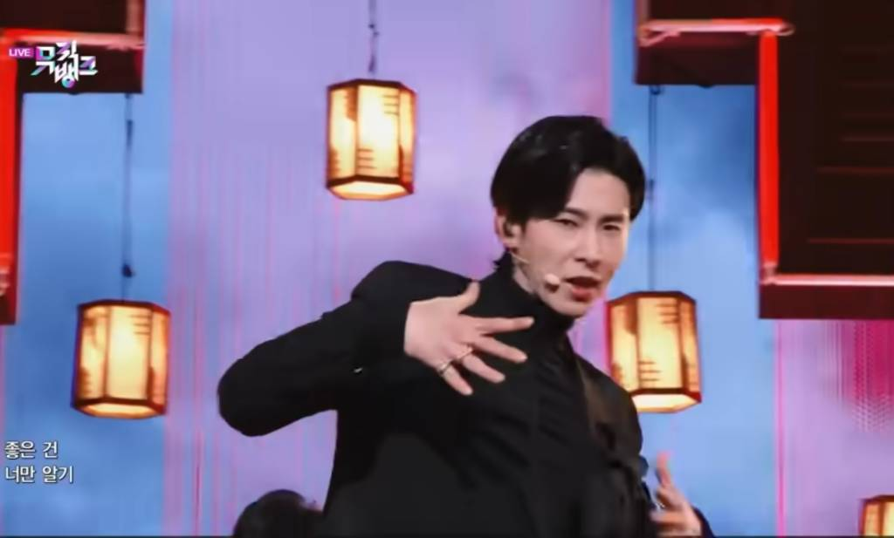
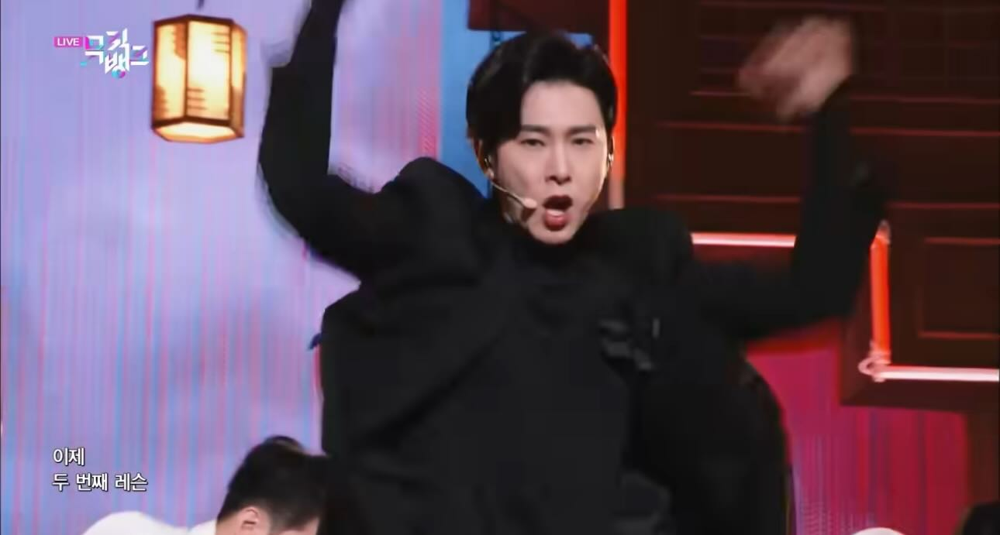
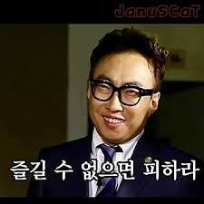

## 이건 첫 번째 레슨, 큰 흐름을 타기

이번 주도 원격 인터뷰와 인터뷰 분석으로 시작했다. 우리는 여전히 1차 창작에 집중하며, 작가들이 자생할 수 있는 환경을 만들기 위해 그 과정에서 발생하는 문제들을 살펴보고 있었다.

지난주 금요일, 대엽님이 진행했던 인터뷰에서 공유받은 이야기 중 인상 깊었던 점은 단순히 그림만으로는 앞으로의 시장에서 버티기 어렵다는 점과 스토리텔링의 중요성이었다. 이번 주 인터뷰 역시 그 연장선에서 진행됐다. 1차 창작과 개인 IP에 대한 생각, 크리에이터적인 사고방식에 대해 질문하고 답을 들었다.

그런데 인터뷰를 거듭할수록 어딘가 석연치 않았다. 본인만의 스타일을 만들고, 그 자체로 사랑받는 IP를 만드는 데에는 생각보다 긴 시간이 필요했다. 현실적인 조건을 고려했을 때, 2차 창작은 생존을 위해 어느 정도 받아들여야 하는 선택처럼 보였다.

지금까지 우리는 의도적으로 2차 창작을 외면해왔다. 하지만 업계에서는 이미 2차 창작을 통해 흥행을 주도한 사례들이 분명히 존재했다. 그렇게 생각이 닿자, 마음속에 남아 있던 어긋난 감각의 정체가 조금씩 또렷해졌다. 문제는 1차 창작이 아니라, 우리가 바라보는 전제였던 것 같았다.

## 이제 두 번째 레슨, 고민하지 않고 실행하기

방향을 정리한 뒤 린캔버스를 다시 업데이트했다. 이전에는 1차 창작만으로 자생 가능한 구조를 고민했다면, 이제는 출발점 자체가 달라졌기에 다시 쓸 수밖에 없었다.

각자 린캔버스를 작성해 공유했고, 논의는 자연스럽게 일러스트레이터의 수입원 문제로 모아졌다. 2차 창작을 통해 부수입을 만들어주는 구조라면 어떨까. 그렇게 생각하니 2차 창작이 가장 활발하게 발생하는 영역부터 공략하는 게 합리적으로 느껴졌다.

우리가 선택한 지점은 게임 업계였다. 특히 강력한 IP를 가진 서브컬처 게임들은 일러스트레이터의 그림체를 통해 끊임없이 재해석된다. 그 과정에서 IP에 관심있는 사람들로부터 하입이 만들어지고, 하입은 다시 팔로워와 영향력으로 이어진다. 그렇게 직업으로서의 유지 구조가 형성된다고 보았다.

린캔버스를 마친 뒤에는 빠른 실험을 위해 역할을 나눴다. 대엽님은 가설과 실험 설계를, 나는 IP 컨택과 가이드라인 리서치를 맡았다. 콘테스트 형태의 컨시어지 MVP가 법적으로 문제가 될 수 있을지 고민했지만, 결국 메일로 확인해보면 되는 문제라는 결론에 도달했다. 고민은 접고 실행 쪽으로 무게를 옮겼다.

## Re: 제로부터 시작하는 신사업 프로젝트

내가 맡은 일은 IP를 제공할 게임사를 선정하고 컨택하는 것이었다. 법적인 가능성보다 컨택 성공 확률을 높이는 데 집중하기로 했다. 오전 중에 호요버스 측에 허가 요청을 보냈고, 생각보다 빠르게 답변을 받았다. 엄밀히 말하면 “알아서 해라”에 가까운 내용이었지만, 충분히 긍정적인 신호로 받아들였다.

오후에는 예정된 원격 인터뷰를 진행했다. 기획 방향성이 어느 정도 잡힌 상태라 질문도 이전보다 훨씬 명확했다. 인터뷰 자체는 문제없이 끝났지만, 논의를 이어가며 다시 의문이 생겼다.

이 문제가 정말 우리가 해결하기 전까지 해결되지 않았던 문제인지, 실험에 투자해야 할 최소 리소스는 어느 정도인지, 그리고 이 문제가 당사자에게 충분히 아픈 문제인지. 질문들은 겹쳤고, 명확한 답은 나오지 않았다.

결국 대엽님이 이야기를 꺼냈고, 지하에서 한 차례 깊은 논의를 했다. 그 결과 우리는 기존에 설정했던 타겟을 내려놓고, 팀 전체가 집중할 하나의 타겟으로 전환하기로 결정했다.

> 다시 말해, 또다시 태초마을로 돌아왔다.

그런데 이상하게도 마음은 후련했다. 지금까지 고민하고 실행했던 모든 과정이 앞으로의 사이클에 분명히 도움이 될 거라는 데에는 모두 동의했다. 의미 없는 시간은 아니었다. 이에 낀 음식 조각을 뺀 기분에 가까웠다.

## 즐길 수 없으면 피하라

새로운 타겟은 중장년층이었다. 어제 진행했던 논의로 자연스럽게 채용 문제에 집중하게 됐고, 이전보다 훨씬 익숙한 상태로 린캔버스 작성부터 시작했다. 작성된 캔버스를 바탕으로 가설 검증을 위한 프로그램을 기획했고, 필요한 리서치를 진행했다.

참가자 모집은 빠르게 이뤄졌고, 순탄한 검증을 기대하며 인터뷰를 시작했다. 다만 우리가 설정한 모집단이 생각보다 특수하다는 점을 뒤늦게 깨달았다. 결과적으로 의도했던 검증 결과는 얻지 못했다.

학습 측면에서는 충분히 의미 있었지만, 준비가 더 치밀하지 못했다는 아쉬움이 남았다. 대화 속에 힌트가 있었는데, 그걸 충분히 살피지 못했다는 생각도 들었다.

업무를 마치고 여자친구와의 약속을 위해 퇴근했다. 준비했던 에그타르트를 받고 좋아하는 모습을 보며 잠시 일을 잊었다. 데이트 막바지, 카페에 앉아 자연스럽게 질문을 던졌고 대화는 어느새 간접 인터뷰처럼 흘러갔다.

그 과정에서 낮에 느꼈던 포인트와 가설에 타당성을 부여할 수 있는 실마리를 발견했다. 구직 의사가 없다는 말 역시, 어쩌면 스스로 만든 신념이거나 아쉬움을 외면한 결과는 아니었을지도 모른다는 생각이 들었다. 아직 검증되지는 않았지만, 우리가 찾고 있던 클루일지도 모른다는 희망을 갖기에는 충분했다.

## 인생은 고민의 연속, 마치 점심 메뉴 선정

다음 날 아침, 전날 계획했던 당근 비즈니스 광고를 실행했다. 예전 같았으면 ‘이 광고가 과연 타겟을 모을 수 있을까’라는 질문에 오래 머물렀을 것이다. 지금은 그것 역시 검증되지 않은 가설일 뿐이라는 걸 어렴풋이 알고 있다.

광고 설정 과정은 낯설었지만, 오히려 실험 대상을 더 명확히 하기 위한 기준들을 발견할 수 있었다. 이어서 카카오톡 오픈채팅방도 열었다. 기존 채널에 스며들지, 새로운 방을 만들지 고민하기보다 일단 열어두는 쪽을 택했다. 시간은 자산이고, 돈이라는 생각이 들었다.

시장이 존재하는지에 대한 질문에는 여전히 정답이 없다. 시장 분석이 레슨이 될 수도 있고, 산책이 레슨이 될 수도 있다. 막연한 불안은 비직관적인 방향으로 사고하고 있으니 당연하다고 받아들였다.

명확하게 보이지는 않지만, 우리가 증명하려는 이 문제에 시장은 존재할 것이라는 믿음을 선택했다. 그렇게 하루를 마무리하고 퇴근하던 길, 광고 신청 거절 메일 하나를 받았다. 그날의 마지막 이벤트였다.
