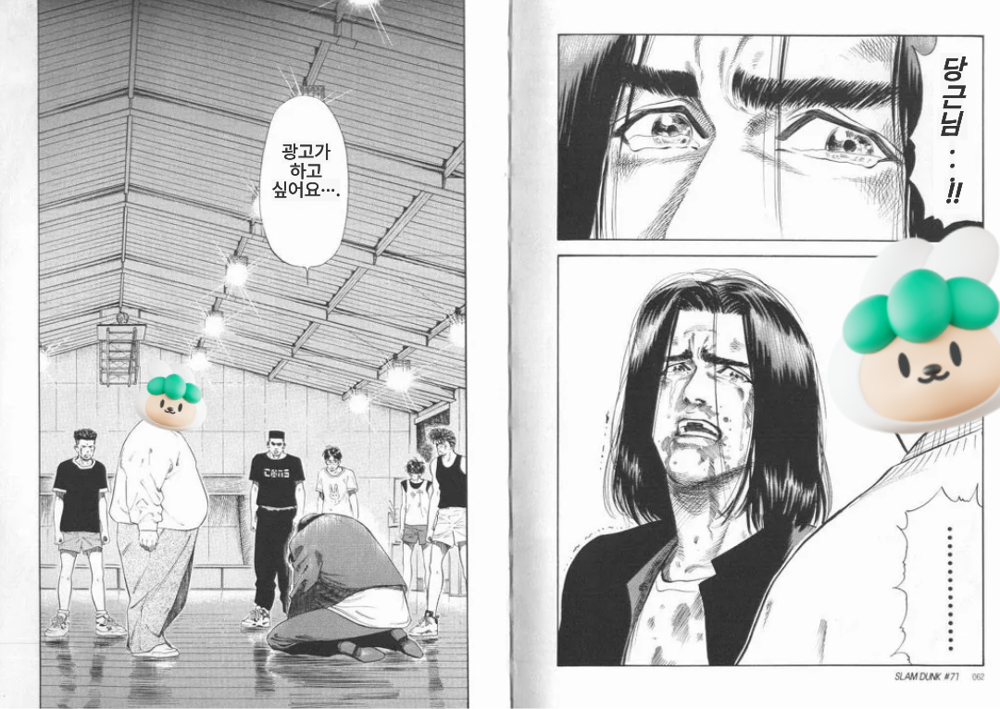
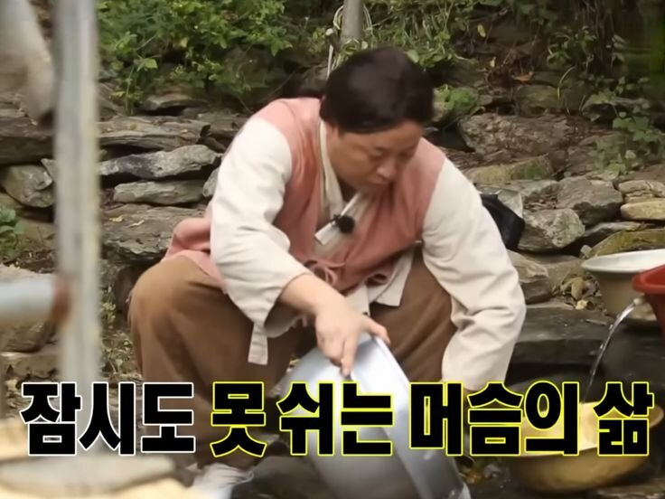

## 마케터를 리스펙트

> 주말 사이 당근 비즈니스 광고 거절을 두 번 받았다.

고려하지 못했던 전제가 분명히 있었고, 그건 겸허히 받아들일 수밖에 없는 부분이었다.

회사에 도착해 광고 수정 방안을 찾다가 대엽님과 오전 미팅을 진행했다. 미팅에서는 요양보호사의 **대근 구직** 이야기가 나왔다. 리서치를 하며 알게 된 점 중 인상 깊었던 건, 요양보호사 업계에서는 갑작스러운 결원이나 휴가로 인해 단기 대체 인력을 구해야 하는 상황이 자주 발생한다는 사실이었다.

이른바 ‘대근’이라 불리는 이 구인은, 짧은 시간 안에 인력을 구해야 한다는 점에서 꽤 큰 고통일 수 있겠다는 가설로 이어졌다. 우리는 조금 더 니치하게, 요양보호사 단기 구직 문제에 집중해보기로 했다.

당연하게도 인터뷰부터 진행했다. 대엽님이 이전부터 들어가 있던 오픈채팅방에서 발견한 요양 업체들을 대상으로 콜드 콜을 시도했고, 일부 업체에서 의향 있음의 시그널을 확인할 수 있었다. 이것만으로 비즈니스 가능성을 판단하기엔 부족했지만, 추후 단기 구직이나 요양보호사 영역으로 피봇팅한다고 가정해도 의미 있는 탐색이라고 판단했다.

추가로 유사 서비스와 커뮤니티도 조사했다. 네이버 카페, 카카오톡 오픈채팅방, 네이버 밴드 등에서 활발한 커뮤니케이션이 이뤄지고 있었고, 요양보호사 구인구직 서비스로는 [케어파트너](https://www.carepartner.kr/)가 있었다. 특히 컨시어지 MVP를 구상하면서 발생할 수 있는 법적 문제를 검토하는 데 참고가 됐다. 법의 가장자리를 공략하려면, 그 가장자리를 먼저 이해해야 한다는 생각이 들었다.

## 뭐 하나 쉬운게 없다

컨시어지 MVP에 대해 계속 고민했다. 결론적으로는 직접 구인과 구직을 연결하는 구조가 아니라, **정보 제공의 형태로 가치를 전달하고 그에 대한 대가를 받는 방식**이 가장 안전하다는 판단에 도달했다.

개발 없이 진행하는 방향으로 의견을 좁히고, 공덕역 근처 요양센터를 대상으로 콜드 콜을 진행했다. 대근 인력이 필요한 경우, 구인이 가능한 리스트를 제공해주겠다는 제안이었다. 일종의 유사 마피아 제안에 가까웠다.

결과는 명확했다. 약 5% 정도의 업체에서 추가 설명 요청은 있었지만, 즉각적으로 이용하겠다는 반응은 없었다. 랜딩 페이지 하나 없는 상태에서 진행한 콜드 콜이었으니, 신뢰를 얻기 어려웠을 거라는 생각도 들었다.

전화를 끊고 나서는 다른 질문이 떠올랐다.

> 우리가 설정한 중장년층은 정말로 구인구직에 대한 강한 욕구를 가지고 있는 걸까. 

어쩌면 우리가 해결하려 했던 건 이들의 근본적인 욕구가 아니라, 특정 직업군을 바라보는 사회적 시선이나 인식의 문제였던 건 아닐까 하는 의문이 남았다.

## 아쉬운거지

그 즈음, 예상하지 못했던 결정이 내려졌다. 신사업을 잠시 중단하고, 플랫폼 팀에 합류해 프론트엔드 개발을 진행해야 한다는 이야기였다.

이렇게 적고 보니 갑작스러운 전환처럼 보이지만, 사실 어느 정도 예상 범주 안에 있던 일이기도 했다. 신사업 팀의 의사결정 방향과 회사 전체의 흐름, 플랫폼 팀의 상황 등을 어렴풋이 알고 있었기 때문이다.

다만 마음에 걸렸던 건, 중간에 얼렁뚱땅 합류하는 느낌이었다. 내가 이 팀에 잘 기여할 수 있을지, 플랫폼 팀이 내 합류를 달갑게 느낄지, 그리고 지금의 상황에서 내가 가진 역량으로 최선의 기여를 할 수 있을지에 대한 고민이었다.

곧 그런 고민도 의미 없다는 결론에 이르렀다. 이제 와서 바꿀 수 있는 건 많지 않고, 결국 어디에서든 해내야 다음 단계로 넘어갈 수 있다고 생각했다. 그래서 빠르게 상황 파악부터 하기로 했다.

레포지토리 초대를 받고 소스 코드를 읽다 보니, 오랜만에 개발자적인 애티튜드가 자연스럽게 올라왔다. 익숙하다는 감각이 먼저 들었다. 군복무 시절 일이 마음대로 흘러가지 않을때 선임이 뱉던 한 마디가 떠올랐다.

> 아쉬운거지.

## 컨텍스트 스위칭

플랫폼 팀의 프론트엔드 구조는 Flask에 내장된 Jinja2와 Vanilla JS 기반 프로젝트, 그리고 마이그레이션이 중단된 Next.js(v15) 프로젝트가 공존하고 있었다. 가장 먼저 판단해야 할 건 **마이그레이션을 계속 가져갈지, 앞으로의 신규 개발은 어디서 진행할지**였다.

마이그레이션 필요성에 대해 정리해 노션으로 공유했고, 논의 끝에 **점진적 마이그레이션과 신규 기능 개발은 Next.js에서 진행**하기로 결정됐다. 당장 해야 할 일은 기존 프로젝트에서 프론트엔드 영역을 분리해 독립적으로 유지보수할 수 있도록 정리하는 작업과, 일부 이전된 영역의 리팩토링, 그리고 점진적 이전 계획 수립이었다.

유지보수와 리팩토링은 기존 경험대로 무리 없이 진행할 수 있을 것 같았지만, 점진적 마이그레이션은 더 효율적인 방법이 필요해 보였다. 그 과정에서 Figma MCP 활용 가능성을 떠올렸고, 주말 동안 간단한 연결 테스트를 진행했다. 유료 계정이 아니라 정확한 테스트는 어려웠지만, 방향성 자체는 확인할 수 있었다.

다시 출근해서 이어서 확인해볼 생각이다.

## 회고_최종_찐막_진짜마지막.md

한 달 가까이 가설을 세우고, 검증하고, 다시 지우는 과정을 반복했다. 그 과정에서 얻은 가장 큰 수확은, 생각하지 않고 실행하는 건 나쁘다는 내 기존의 믿음이 완전히 맞는 건 아니라는 사실이었다.

이제는 다시 개발자의 마인드로 돌아와, 내가 할 수 있는 일을 찾는 단계에 들어왔다. 또 하나의 새로운 시작 같다. 설렘도 있고, 새롭게 알아가야 할 것들에 대한 호기심도 있다.

잘되길 바라면서, 동시에 잘되게 만들어야겠다는 마음이다.
